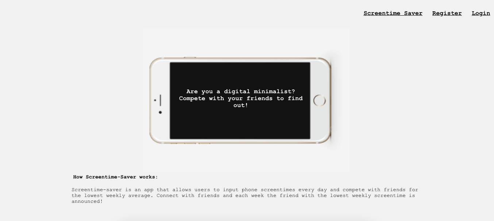
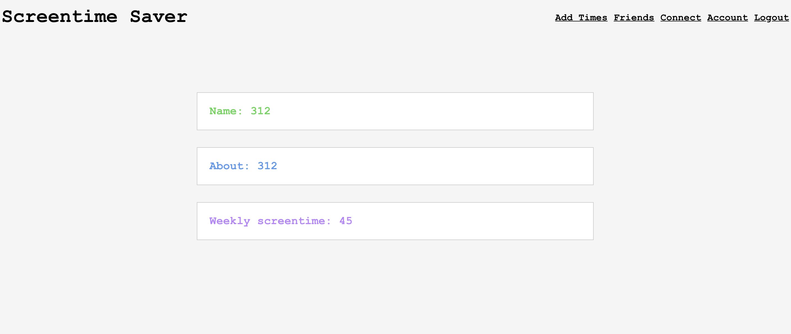
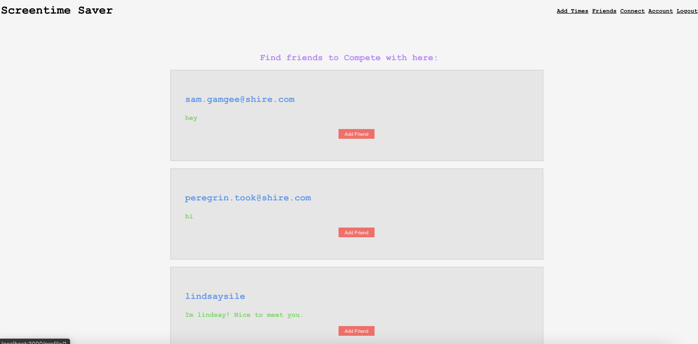
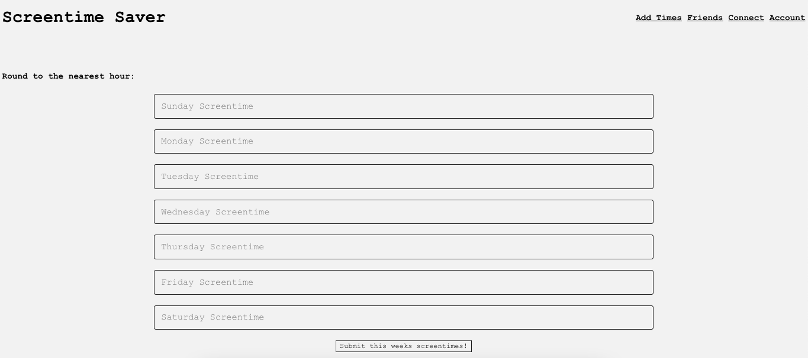
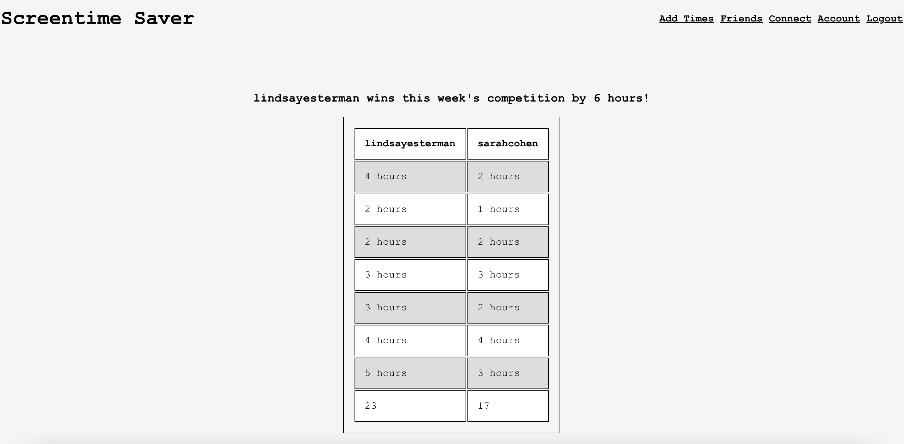

# Screentime Saver

Link to live website: https://screentime-saver.vercel.app/

Screentime Saver is dedicated to aspiring digital minimalists. Users can post screentimes, make a profile, and compete with friends to win the lowest screentime of the week!

## The Problem: 

The average adult spends over 3 hours on their phone each day. That is a lot of time wasted, scrolling mindlessly through posts. To combat this form of "connection" taking over, I created Screentime Saver which inspires users to spend less time on their phone. 

## The App 

**Register and Login:**

**Make a Profile:**

**View Users to Connect with:**

**Add Screentimes:**

**Compare times with Friends:** 

Link to the server repo: https://github.com/lindsayesterman/screentime-saver-server

## Stack 

React, CSS, Node, Express, and PostgreSQL.

